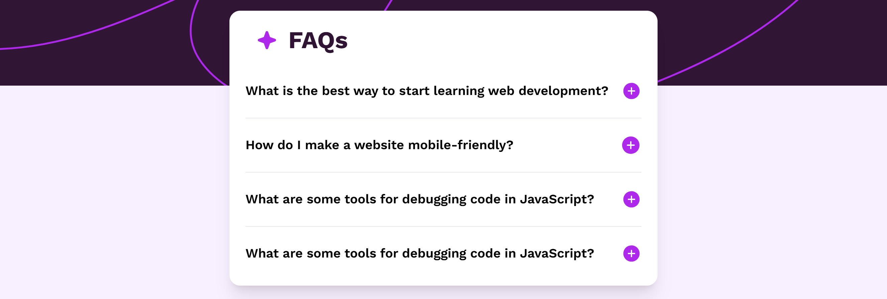

# FAQ accordion solution

This is a solution to the [FAQ accordion challenge on Frontend Mentor](https://www.frontendmentor.io/challenges/faq-accordion-wyfFdeBwBz). 

## Table of contents

- [Overview](#overview)
  - [Screenshot](#screenshot)
  - [Links](#links)
- [My process](#my-process)
  - [Built with](#built-with)
  - [What I learned](#what-i-learned)

## Overview

### Screenshot

### Links

- Solution URL: (https://nakul003.github.io/Front-end-Projects/FAQ-accordion/index.html)

## My process

### Built with

- Semantic HTML5 markup
- Tailwind CSS with custom properties
- Flexbox
- JavaScript toggle button

### What I learned

- How to handle responsiveness with tailwind.
- learned how to create toggle buttons with JS.
- learned about preserveAspectRatio="xMidYMid slice" attribute

### Future Updates

I'm looking forward to improve how to handle responsiveness in more efficient and manageable ways.

