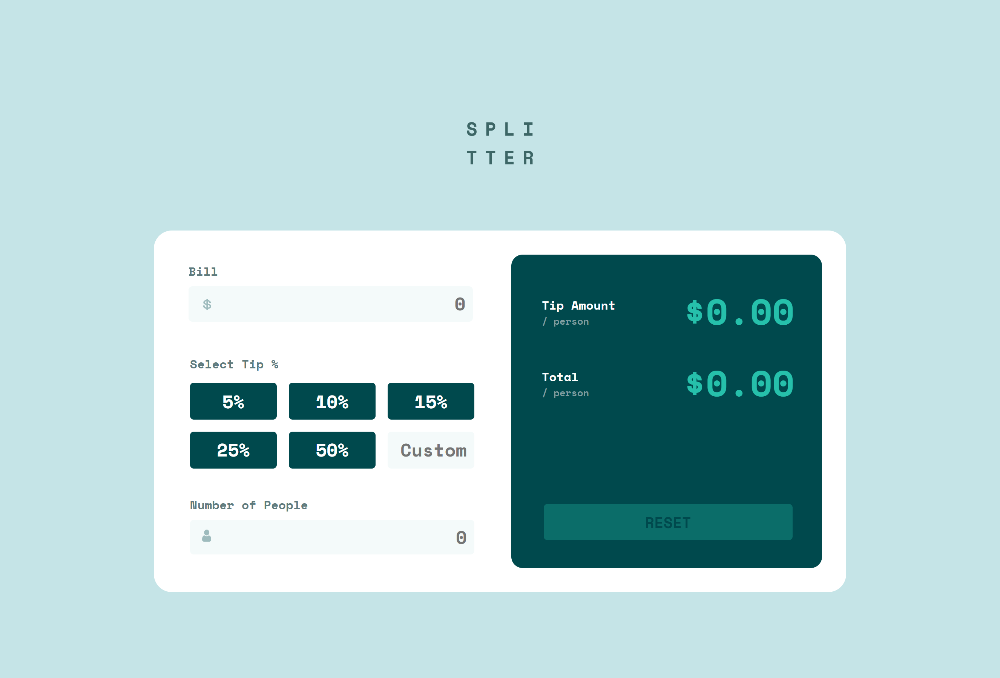

# Frontend Mentor - Tip calculator app solution

This is a solution to the [Tip calculator app challenge on Frontend Mentor](https://www.frontendmentor.io/challenges/tip-calculator-app-ugJNGbJUX). Frontend Mentor challenges help you improve your coding skills by building realistic projects.

## Table of contents

- [Overview](#overview)
  - [The challenge](#the-challenge)
  - [Screenshot](#screenshot)
  - [Links](#links)
  - [Built with](#built-with)
  

## Overview

### The challenge

Users should be able to:

- View the optimal layout for the app depending on their device's screen size
- See hover states for all interactive elements on the page
- Calculate the correct tip and total cost of the bill per person

### Screenshot

### Links

- [Visit live site](https://nakul003.github.io/Frontend-Projects/Tip-calculator-app/)

- [Visit profile on frontend Mentor](https://www.frontendmentor.io/profile/Nakul003)

### Built with

- HTML
- CSS
- JavaScript
- Flexbox
- CSS Grid
- Mobile-first workflow
